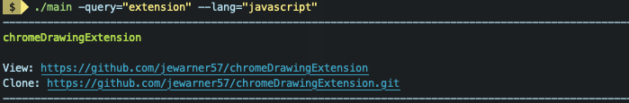
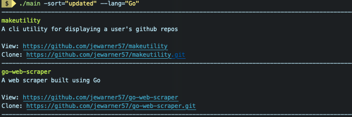

# BEW - Statically Typed Languages Final Project

## Github Repo Viewer CLI Utility
  * This utility provides a simple CLI to quickly view, search, and sort a user's github repositories with one quick command.

## Installation
  ```
  git clone git@github.com:jewarner57/makeutility.git
  cd makeutility
  go build ./main.go
  ```

## Usage

### Flags
  * **query** (string)
    * A query string to filter results.
  * **lang** (string)
    * Filter results by language
  * **sort** (string)
    * A string indicating how to sort the results.
    	* One of: interactions, reactions, author-date, comitter-date, updated
  * **setUser** (string)
    * Save a new default username.
    * Default username is saved in config.json.
  
## Examples

